**2.1. Original code of broadcast chat.**  
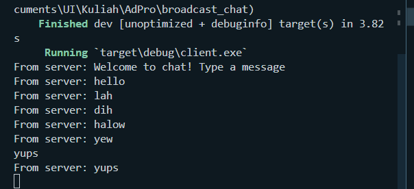  
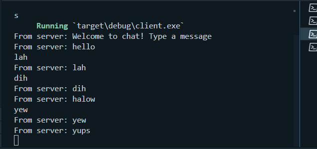
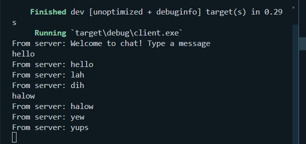
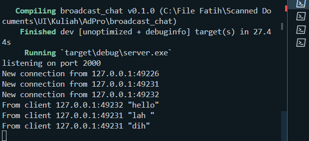  

After we run the server with `cargo run --bin server` and run three clients with `cargo run --bin client` from different terminals, we can see that the server acts like, well, a server. It broadcasts the chats from a client to another client, so when a client types in a message in the command line, the server will transfer/send it to all clients connected to it.

**2.2 Modifying port**
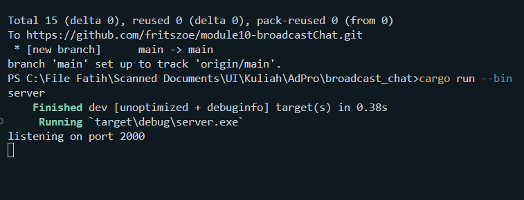
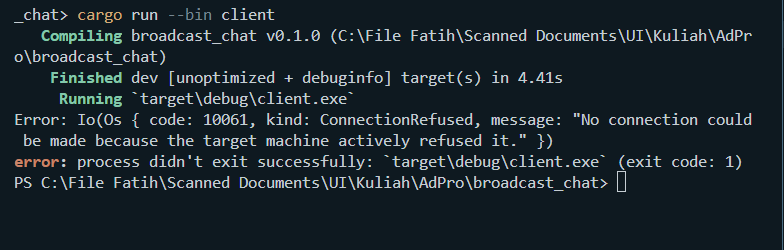

If the port of the client and server are different, they couldn't communicate with each other, that is why as seen on the 1st picture, the server is listening on port 2000 but the client is on port 8080, so the client couldn't establish any connection to the server.

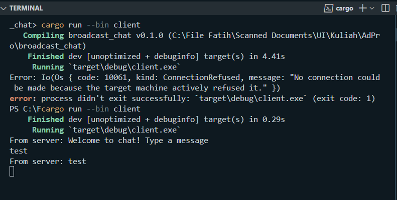
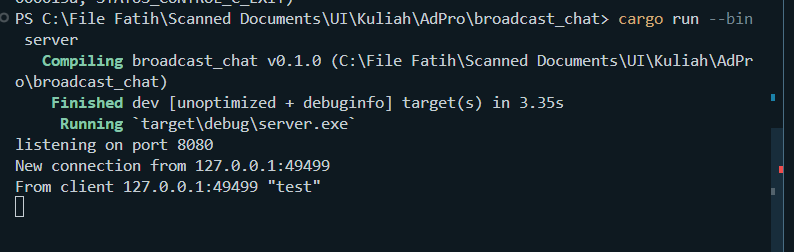

Now here, both the client and server are on port 8080, and as we can see in the given picture, the server is listening on port 8080 and the client was already on port 8080, so the client could establish a connection and send a message that is recieved by the server, as seen on the picture above.

**abc**
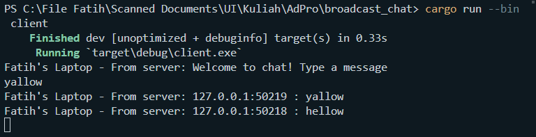
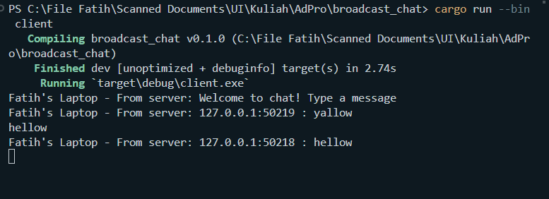
The output above is achieved by changing the code in client.rs as can be seen in the commit Experiment 2.3

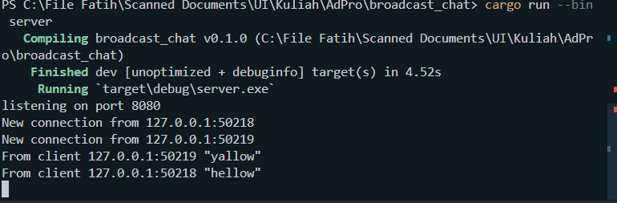
As for this one, this is achieved by changing the code in server.rs as can be seen in the commit Experiment 2.3 as well